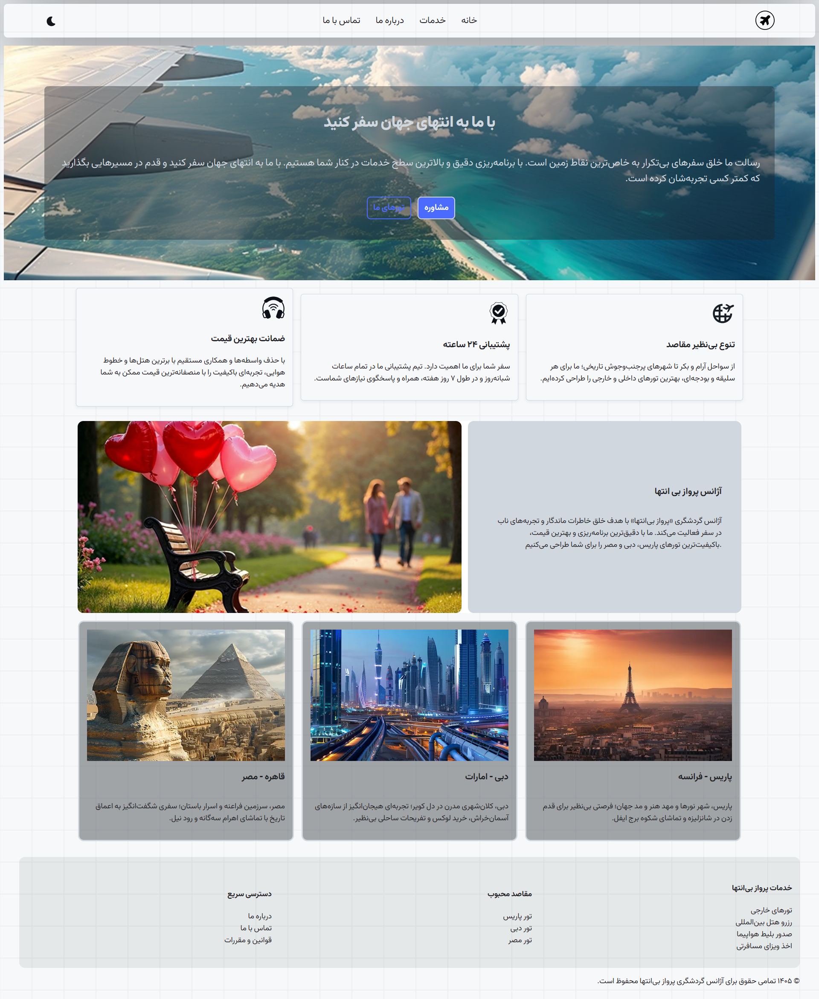
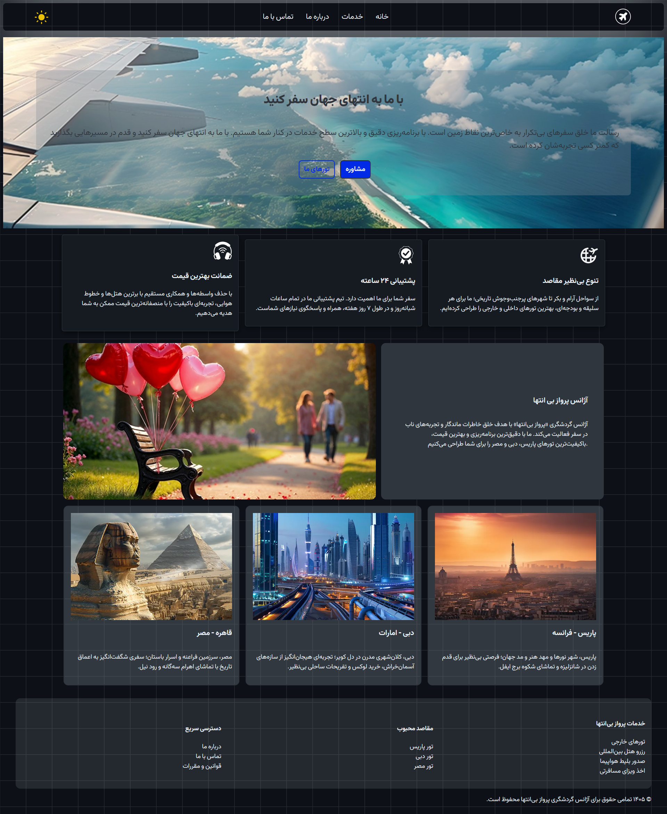

# Mini Landing Page — Travel Agency

A fully responsive landing page for a fictional travel agency ("پرواز بی‌انتها"), built with vanilla HTML, CSS, and JavaScript. This is the final project of Chapter 1 in my frontend fundamentals practice series.

## Preview

[![Demo Video]](docs/demo.mp4)

### Screenshots

<table>
  <tr>
    <td align="center"> Light Theme</td>
    <td align="center"> Dark Theme</td>
  </tr>
</table>

## Features

- Full landing page structure: navbar, hero, features, about, services, footer
- Dark / Light theme toggle — switches icons, logo, and images together via a data-driven approach
- Responsive hamburger menu for mobile navigation
- Independent responsive breakpoints per section
- Custom web fonts (Kalameh)

## Tech Stack

- HTML5
- CSS3 (Custom Properties, Flexbox, Media Queries) — split by component (`nav-bar.css`, `hero.css`, `features.css`, `about-us.css`, `services.css`, `footer.css`)
- Vanilla JavaScript (DOM manipulation, data-driven UI updates)

## What I Practiced

- Structuring a multi-section page with separated CSS per component
- Refactoring repetitive DOM updates into a data-driven function (`changeIcons`) instead of duplicating logic per element
- Debugging real layout bugs (invalid CSS property values, incorrect element targeting in JS)
- Catching and cleaning up leftover debugging code before shipping

## Part of a Series

This is the final project of Chapter 1 ("HTML/CSS Basics") in my frontend fundamentals series, before moving into Chapter 2 and eventually React/TypeScript.