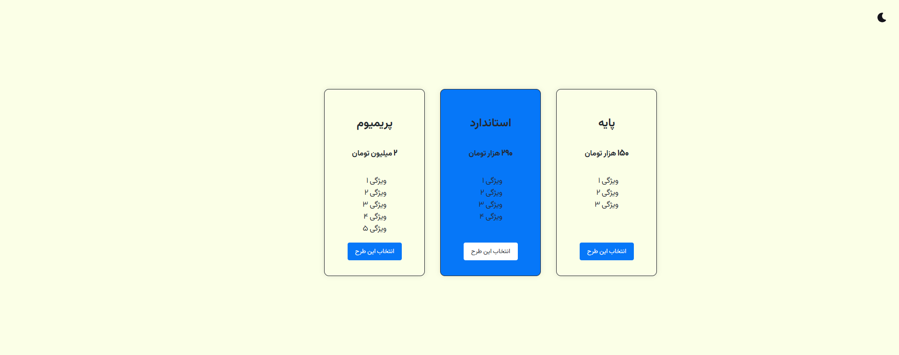

# Pricing Table

A responsive pricing table with three plans, built with vanilla HTML, CSS, and JavaScript as part of my frontend practice series.

## Preview

[![Demo Video]](docs/demo.mp4)

### Screenshots

<table>
  <tr>
    <td align="center"> Light Theme</td>
    <td align="center"> Dark Theme</td>
  </tr>

</table>

## Features

- Three-tier pricing layout with a highlighted "recommended" plan
- Fully responsive: switches from row to column layout under 768px
- Dark / Light theme toggle using CSS custom properties and `data-theme` attribute
- Hover animation on cards (scale transform)
- Custom web fonts (Kalameh)

## Tech Stack

- HTML5
- CSS3 (Custom Properties, Flexbox, Media Queries)
- Vanilla JavaScript (DOM manipulation, event listeners)

## What I Practiced

- BEM naming convention (`block__element`, `block__modifier`)
- Real responsive design with a breakpoint-based layout change
- Theme switching via `data-theme` attribute
- Highlighting a specific card with a modifier class (`pricing-card__marked`)

## Part of a Series

This is project #2 in my frontend fundamentals practice series, moving from vanilla JS toward React and TypeScript.
