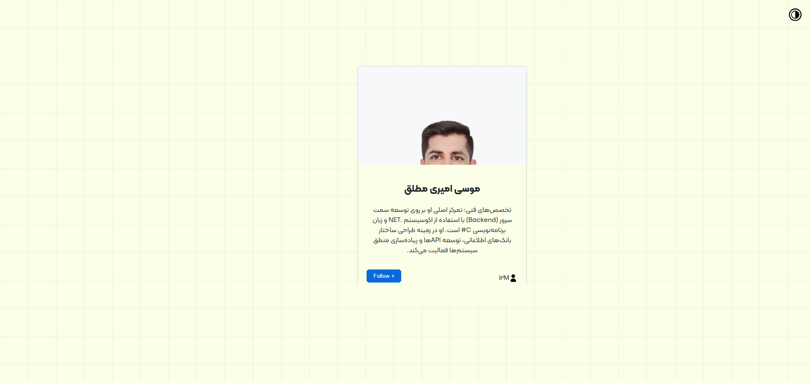
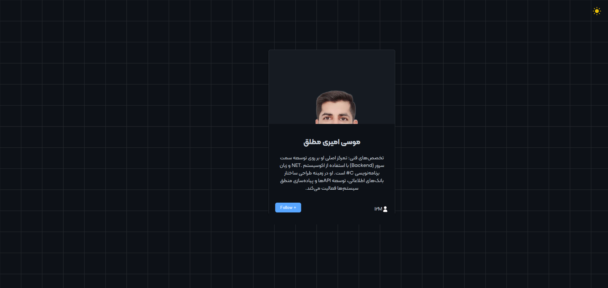

# Responsive Bio Card

A simple, single-column bio card built with vanilla HTML, CSS, and JavaScript as part of my frontend practice series.

## Preview

[![Demo Video]](docs/demo.mp4)

<table>
  <tr>
    <td align="center"> Light Theme</td>
    <td align="center"> Dark Theme</td>
  </tr>
  <tr>
    <td align="center"> Hover — Light</td>
    <td align="center"> Hover — Dark</td>
  </tr>
</table>

## Features

- Fluid single-card layout (adapts smoothly across screen sizes)
- Hover-triggered content reveal with smooth transitions
- Dark / Light theme toggle using CSS custom properties and `data-theme` attribute
- Custom web fonts (Kalameh)

## Tech Stack

- HTML5
- CSS3 (Custom Properties / CSS Variables)
- Vanilla JavaScript (DOM manipulation, event listeners)

## What I Practiced

- Structuring CSS with design tokens (colors, spacing, radius as variables)
- Theme switching without a framework
- Basic DOM event handling (mouseenter/mouseleave, click)

## Known Issues / Next Improvements

- Refactor class/variable naming for clarity (some names inherited from an unrelated template)
- Handle edge case where viewport height is short (content may clip due to fixed `90vh` container)
- Replace inline style manipulation with `classList.toggle()` for cleaner state handling

## Part of a Series

This is project #1 in my frontend fundamentals practice series, moving from vanilla JS toward React and TypeScript.