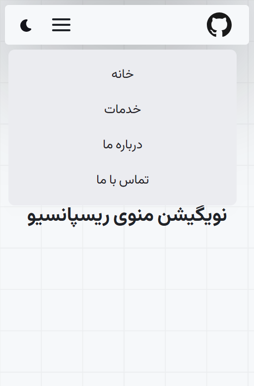
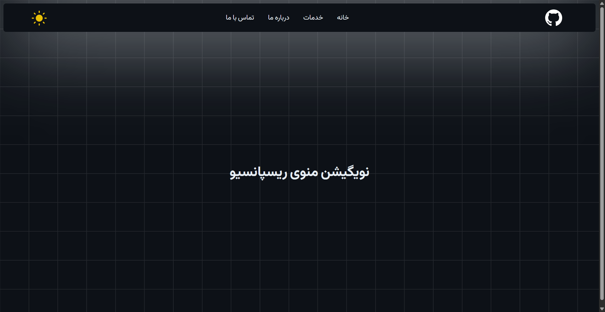
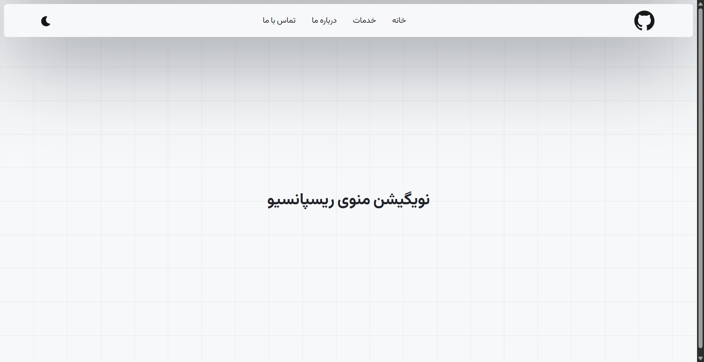
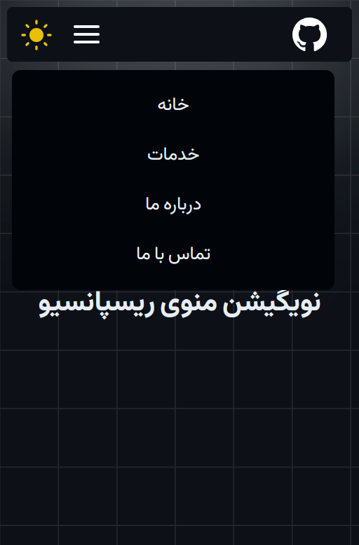

# Responsive Navbar

A lightweight, dependency-free responsive navigation bar built with vanilla HTML, CSS, and JavaScript. Features a dark/light theme switcher and a hamburger menu for mobile, with RTL/Persian typography using the Kalameh variable font.

## Features

- 🌗 **Dark / Light theme toggle** — instant switch via `data-theme` attribute, no page reload, no flash of unstyled content
- 📱 **Fully responsive** — collapses into a hamburger/mobile menu below `767px`
- 🎨 **Design-token based styling** — colors, spacing, radius, and shadows are all CSS custom properties, so re-theming means editing variables, not selectors
- 🔤 **RTL-first** — built for Persian (`dir="rtl"`, `lang="fa"`) with the self-hosted Kalameh web font (Thin/Regular/Bold/Black weights, `.woff2`)
- ⚡ **Zero dependencies** — no build step, no framework, just static files

## Demo

https://github.com/user-attachments/assets/demo.mp4

> If the video above doesn't render, see [`docs/demo.mp4`](docs/demo.mp4).

## Screenshots

<table>
  <tr>
    <td align="center">
      <br/>
      <sub>Mobile — Light Theme</sub>
    </td>
    <td align="center">
      <br/>
      <sub>Desktop — Dark Theme</sub>
    </td>
  </tr>
  <tr>
    <td align="center">
      <br/>
      <sub>Desktop — Light Theme</sub>
    </td>
    <td align="center">
      <br/>
      <sub>Mobile — Dark Theme</sub>
    </td>
  </tr>
</table>

## Project Structure

```
responsive-navbar/
├── index.html          # Markup for the navbar + demo page
├── base-style.css       # Design tokens (CSS variables), fonts, theme definitions
├── custome-style.css     # Navbar layout, mobile menu, responsive breakpoints
├── script.js             # Theme toggle + mobile menu logic
├── docs/
│   ├── demo.mp4
│   └── images/
│       ├── responsive-menu-light-desktop.png
│       ├── responsive-menu-darkdesktop.png
│       ├── responsive-menu-mobile-light.png
│       └── responsive-menu-mobile-dark.png
└── assets/
    ├── fonts/            # Kalameh WOFF2 weights (Thin, Regular, Bold, Black)
    └── images/            # Logo, theme-switch icons, background SVG
```

## Getting Started

No build tools required — it's plain HTML/CSS/JS.

```bash
git clone https://github.com/mousaamiri/responsive-navbar.git
cd responsive-navbar
```

Then just open `index.html` in your browser, or serve it locally:

```bash
# with VS Code
Right-click index.html → Open with Live Server

# or with Python
python -m http.server 5500
```

## How It Works

**Theme switching** — `script.js` reads and toggles the `data-theme` attribute on `<body>`. All colors in `base-style.css` are defined as CSS custom properties under `:root`/`[data-theme="light"]` and `[data-theme="dark"]`, so the whole UI re-themes instantly without touching component styles.

**Mobile menu** — below `767px`, `.nav-menu` is hidden by default and toggled via the `.active` class on hamburger click, sliding in as an absolutely positioned dropdown.

## Customization

To change the color palette, edit the CSS variables at the top of `base-style.css` (`--color-primary`, `--bg-*`, `--fg-*`, etc.) — every component references these tokens, so a single edit re-themes the entire navbar.

To change the responsive breakpoint, update the `max-width: 767px` media query in `custome-style.css`.


## License

MIT