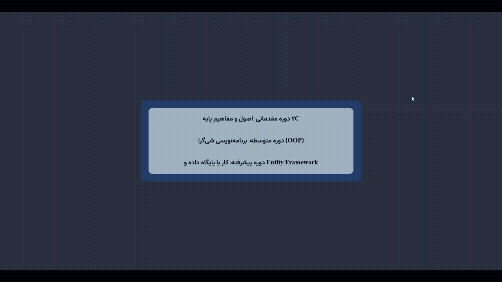

# Accordion / FAQ انیمیشن‌دار

آکاردئون تک‌بازشو (single-open) برای نمایش فهرست دوره‌ها یا سوالات متداول؛ با کلیک روی هر تیتر، پنل مرتبط باز و بقیه پنل‌ها بسته می‌شوند.

## تکنیک‌های استفاده‌شده

- انیمیشن باز/بسته شدن نرم با `max-height` + `transition` (به‌جای `display`)
- `:has()` برای گردکردن گوشه‌های تیتر آخر وقتی پنل مجاورش باز است
- فونت فارسی سفارشی (Arad) بارگذاری‌شده با `@font-face`

## پیش‌نمایش

## اجرا

فایل `index.html` را مستقیم در مرورگر باز کنید — بدون build step.
