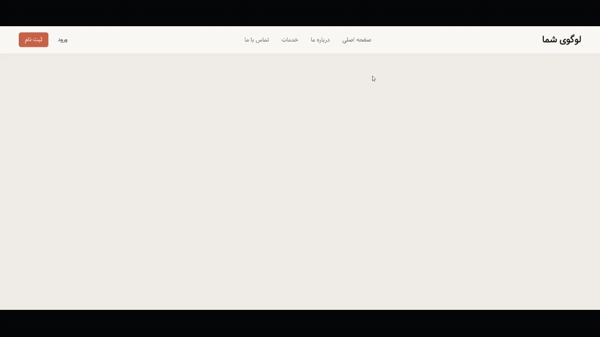

# Animated Navbar Underline

A navbar where links and buttons get an animated outline/highlight on hover, built to avoid repeating a navbar structure I'd already built multiple times before — this exercise focuses purely on the hover animation technique.

## Preview

## What I Practiced

- Animating a `::after` pseudo-element with `transform: scale()` + `opacity` instead of layout-affecting properties
- Using `transform-origin: center` so the highlight grows outward from the middle rather than one edge
- Applying the same hover-highlight pattern consistently across both nav links and a button (`.btn-login`)

## Note on Styling

The color palette and base visual style (colors, spacing scale, border radius values) were AI-generated starting points — I didn't design those from scratch. The navbar markup and the underline/highlight animation logic itself, however, are my own, built without copying an existing navbar structure since I've implemented that layout several times before in earlier exercises.

## Part of a Series

Part of Chapter 2 ("CSS Advanced") in my frontend fundamentals practice series, focused on animations and transitions.
