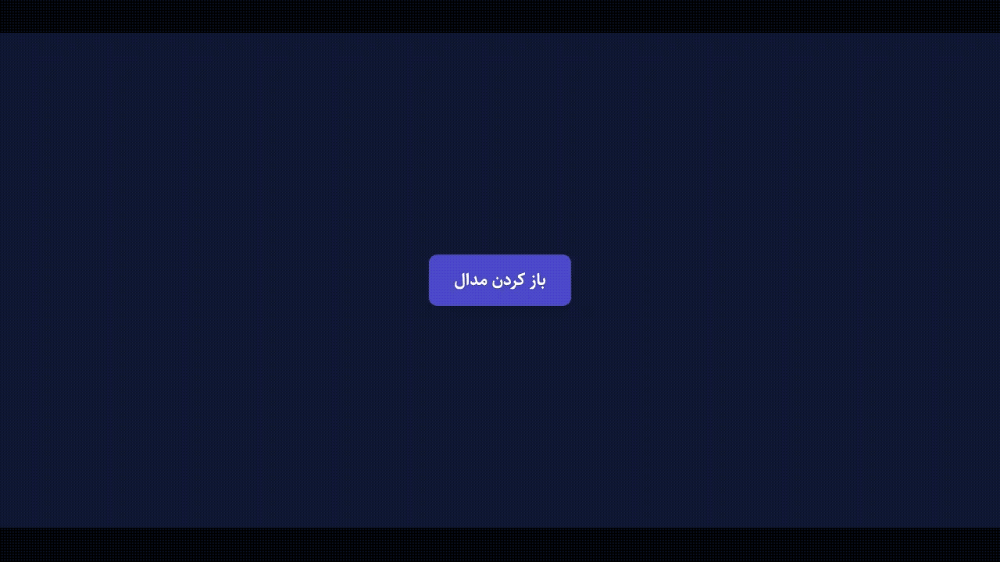

# Modal Enter/Exit Animation

مودال (پنجره بازشو) با انیمیشن ورود و خروج نرم؛ بستن با دکمه، یا با کلیک روی پس‌زمینه‌ی بیرون از باکس مودال ممکن است.

## تکنیک‌های استفاده‌شده

- انیمیشن ترکیبی `opacity` (روی overlay) و `scale` (روی باکس مودال)
- فورس reflow (خواندن `offsetHeight`) قبل از افزودن کلاس `active` برای تضمین اجرای transition
- استفاده از رویداد `transitionend` برای خارج کردن مودال از layout (`display: none`) بعد از پایان انیمیشن خروج، به‌جای مخفی‌کردن آنی

## پیش‌نمایش

## اجرا

فایل `index.html` را مستقیم در مرورگر باز کنید — بدون build step.
