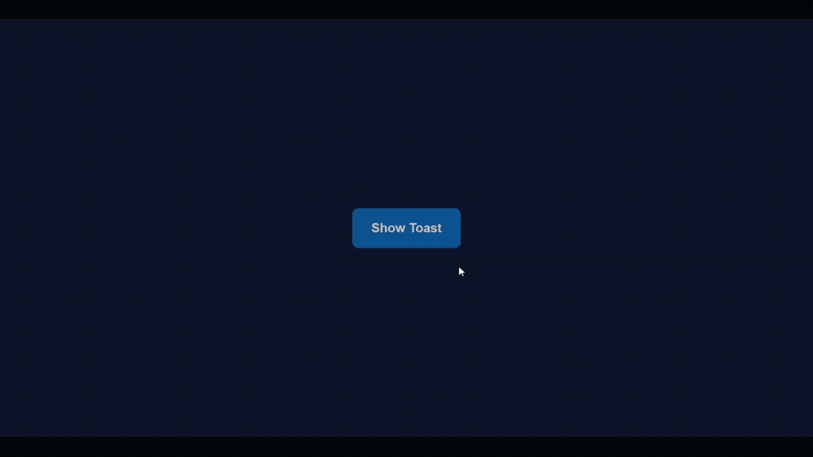

# Toast / Notification

A dismissible toast notification system: click a button to spawn a toast that animates in, auto-dismisses after 3 seconds, and can also be closed manually — with a proper exit animation before removal from the DOM.

## Preview

## What I Practiced

- Animating with `transform` + `opacity` only (no layout-affecting properties)
- Using `requestAnimationFrame` to make sure the enter transition actually triggers after the element is added to the DOM
- Delaying DOM removal with `setTimeout` until the exit transition finishes, instead of removing the element instantly — the same problem I ran into with the modal project, solved again in a new context
- Cloning a hidden `<template>`-style element to create multiple independent toast instances

## Known Issues / Next Improvements

- The exit delay is hardcoded with `setTimeout(300)` to match the CSS transition duration — using the `transitionend` event instead would be more robust if the duration ever changes

## Part of a Series

Part of Chapter 2 ("CSS Advanced") in my frontend fundamentals practice series, focused on animations and transitions.
