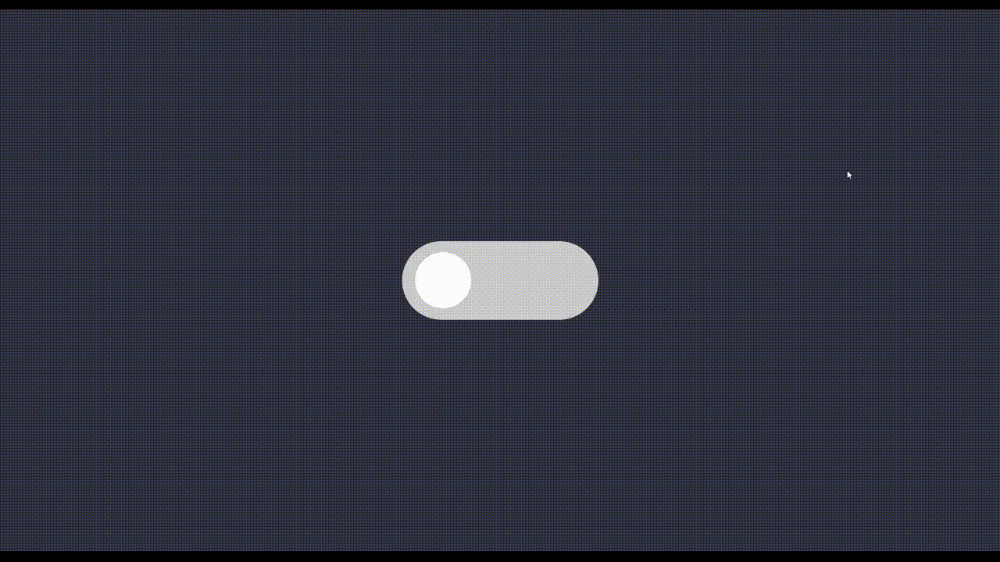

# Toggle Switch

سوییچ روشن/خاموش انیمیشن‌دار با CSS خالص. به‌جای `<label>` از یک کانتینر قابل‌کلیک استفاده شده که وضعیت چک‌باکس مخفی داخلش را با جاوااسکریپت تغییر می‌دهد.

## تکنیک‌های استفاده‌شده

- `:has()` برای استایل‌دهی به کانتینر بر اساس وضعیت چک‌باکس داخلش
- `transition` روی `transform` و `background-color` برای حرکت نرم دسته سوییچ
- مخفی‌سازی input واقعی (`display: none`) و شبیه‌سازی ظاهری با یک `div`

## پیش‌نمایش

## اجرا

فایل `index.html` را مستقیم در مرورگر باز کنید — بدون build step.
