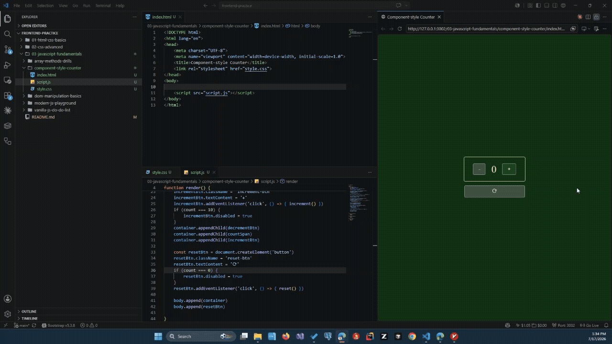

# Component-style Counter

شبیه‌سازی الگوی «state → render» با جاوااسکریپت خالص — پایه‌ی مدل ذهنی کامپوننت در React.

## مفاهیم تمرین‌شده

- **State متمرکز** — یک متغیر (`count`) به‌عنوان تنها منبع حقیقت
- **تابع render() به‌عنوان «کامپوننت»** — کل UI هر بار از رو state از نو ساخته می‌شه، بدون دستکاری پراکنده‌ی DOM
- **Container اختصاصی برای رندر** — به‌جای پاک/بازسازی کل `<body>`، رندر فقط داخل یک `
` مشخص انجام می‌شه (مشابه `#root` در React)
- **UI مشتق‌شده از state** — غیرفعال شدن دکمه‌های `+`/`-`/`Reset` مستقیماً از رو مقدار `count` محاسبه می‌شه، نه با تنظیم دستی جدا

## قانون طلایی رعایت‌شده در این پروژه

هیچ event listener مستقیم DOM رو تغییر نمی‌ده؛ فقط state رو عوض می‌کنه و `render()` را صدا می‌زند:

## پیش‌نمایش

## اجرا

فایل `index.html` رو باز کن و با دکمه‌های `+`, `-`, `Reset` تعامل کن.