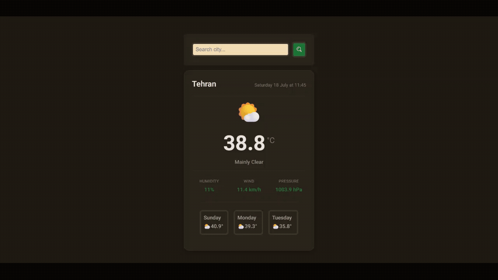

# Mini Weather App with Fetch

اپلیکیشن آب‌وهوا با ترکیب DOM + state + async — جمع‌بندی همه‌ی مفاهیم فصل ۳.

## مفاهیم تمرین‌شده

- **دو fetch وابسته به هم** — تبدیل نام شهر به مختصات (geocoding API)، سپس دریافت آب‌وهوا با همون مختصات
- **State متمرکز** — یک آبجکت واحد (`state`) شامل `weatherData`, `isLoading`, `errorMessage`
- **الگوی setState** — تابع `setState()` مقادیر جدید را با state فعلی merge می‌کند و خودش `render()` را صدا می‌زند؛ هیچ تغییر state‌ای مستقیم و بی‌واسطه انجام نمی‌شود
- **الگوی render تصمیم‌گیرنده** — یک تابع `render()` بر اساس ترکیب `isLoading` / `errorMessage` / `weatherData` تصمیم می‌گیرد کدام UI نمایش داده شود
- **Intl.DateTimeFormat** — فرمت‌دهی تاریخ و روز هفته بدون کتابخانه‌ی جانبی

## نکته‌ی کلیدی

الگوی نهایی state این پروژه:

```js
let state = { weatherData: null, isLoading: false, errorMessage: null }

function setState(newState) {
    state = { ...state, ...newState }
    render()
}
```

هر تغییر state از یک نقطه‌ی واحد (`setState`) عبور می‌کند و همیشه `render()` را دوباره صدا می‌زند. این الگو نسخه‌ی دستی و ساده‌شده‌ی چیزی است که در React با `useState` به‌صورت خودکار انجام می‌شود.
## پیش‌نمایش


## اجرا

فایل `index.html` را باز کن؛ به‌صورت پیش‌فرض آب‌وهوای تهران نمایش داده می‌شود. برای جست‌وجوی شهر دیگر، نام آن را (به انگلیسی) وارد کن.