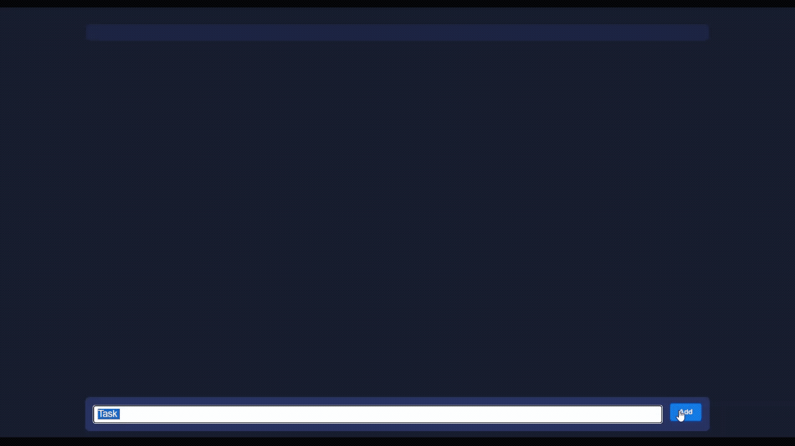

# Vanilla JS To-Do List

مدیریت state با یک آرایه‌ی JS ساده (بدون فریم‌ورک)، به‌جای دستکاری مستقیم DOM.

## مفاهیم تمرین‌شده

- **State به‌عنوان source of truth** — آرایه‌ی `notes` تنها منبع حقیقتِ داده‌هاست؛ DOM فقط بازتاب اونه
- **الگوی render()** — با هر تغییر در state (اضافه/حذف/تغییر وضعیت)، کل UI از نو بر اساس state ساخته می‌شه
- **createElement / appendChild** — ساخت پویای المان‌ها از داده، به‌جای template ثابت در HTML
- **Event delegation در سطح آیتم** — هر نوت موقع ساخته‌شدن، listener مخصوص خودش رو می‌گیره (checkbox و delete)
این دقیقاً همون مدل ذهنی‌ایه که در React با state و re-render پیاده‌سازی می‌شه — اینجا فقط دستی انجامش دادیم.

## پیش‌نمایش

## اجرا

فایل `index.html` رو باز کن، نوت اضافه/حذف کن و تیک بزن.
## نکته‌ی کلیدی

قبل از این نسخه، اولین پیاده‌سازی مستقیم روی DOM کار می‌کرد (کلون کردن template و append مستقیم)، بدون هیچ آرایه‌ای برای نگه‌داری داده‌ها. مشکل: هیچ‌وقت نمی‌شد پرسید «چند نوت هست؟» یا «کدوم‌ها تیک خوردن؟» بدون گشتن در DOM.

نسخه‌ی فعلی این الگو رو معکوس کرده
