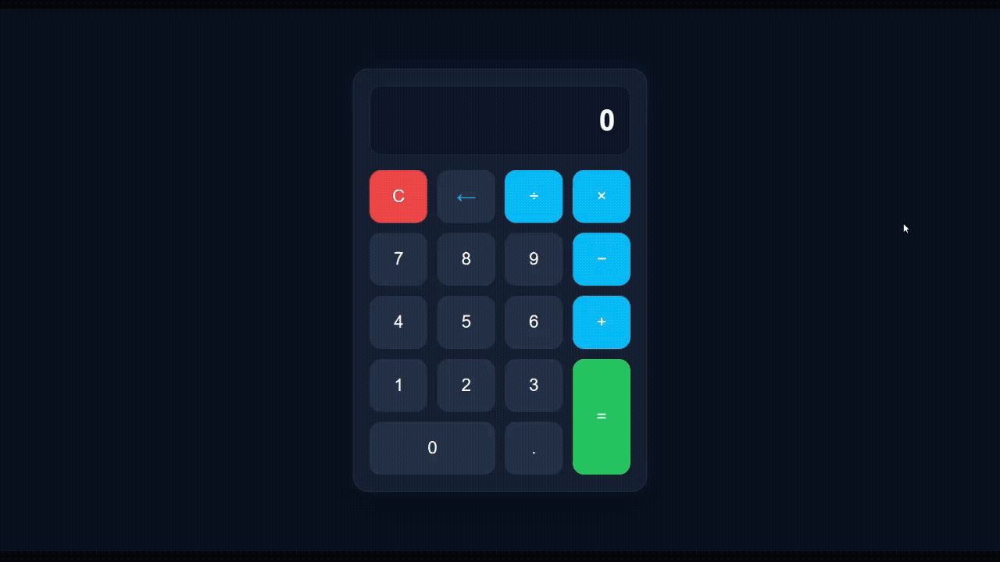

# Calculator

ماشین‌حساب با مدیریت state مبتنی بر state machine (حالت‌های مشخص و گذار بین آن‌ها).

## مفاهیم تمرین‌شده

- **State machine با mode مشخص** — پنج حالت ثابت (`typingFirst`, `operatorSelected`, `typingSecond`, `result`, `error`) که رفتار هر دکمه بر اساس حالت فعلی تصمیم‌گیری می‌شود
- **Immutable state updates** — تمام تغییرات state از طریق `setState({...})` عبور می‌کنند؛ هیچ‌جای دیگر کد مستقیم `state.x = y` نمی‌نویسد
- **جداسازی خواندن از نوشتن** — خواندن از `state` سراسری در همه‌جا مجاز است (برای تصمیم‌گیری)، اما نوشتن فقط از یک نقطه‌ی واحد (`setState`) انجام می‌شود
- **Event delegation** — یک listener روی کانتینر `.buttons`، تشخیص دکمه‌ی کلیک‌شده با `data-value` / `data-action`
- **UI ثابت در HTML، فقط محتوا در JS** — دکمه‌ها در HTML نوشته شده‌اند (چون تعدادشان ثابت است)؛ فقط صفحه‌نمایش با state هماهنگ می‌شود

## نکته‌ی کلیدی: چرا نوشتن باید از یک نقطه عبور کند

اگر state از چند جای مختلف کد تغییر کند، رهگیری «کِی و کجا عوض شد» سخت می‌شود — دقیقاً مثل اینکه چند نفر بدون هماهنگی به یک گاوصندوق مشترک دسترسی داشته باشند. راه‌حل:
با این الگو، اگر بخواهی بفهمی state کِی تغییر کرد، کافی‌ست فقط داخل `setState` یک `console.log` بگذاری — چون همه‌ی تغییرات، بدون استثنا، از همان‌جا رد می‌شوند.

## اسم این الگو

این معماری نسخه‌ی ساده و دستی چیزی است که در دنیای فرانت‌اند به آن **unidirectional data flow** (جریان یک‌طرفه‌ی داده) می‌گویند: تغییر همیشه در یک مسیر ثابت جریان دارد —
نسخه‌ی معروف و رسمی این الگو **Redux** نام دارد (که خودش از معماری **Flux** فیسبوک الهام گرفته)، جایی که یک `reducer` مسئول تنها نقطه‌ی تغییر state است، دقیقاً نقشی که اینجا `setState` بازی می‌کند. React خودش هم در سطح پایه‌تر، با `useState` و `useReducer`، همین اصل را اجرایی می‌کند — پس این چیزی نیست که فقط اینجا اختراع کرده باشی؛ داری زیرساخت فکری چیزی را می‌سازی که در ابزارهای واقعی هم اسم دارد.

## پیش‌نمایش

## اجرا

فایل `index.html` را باز کن و با کلیک روی دکمه‌ها محاسبه کن.