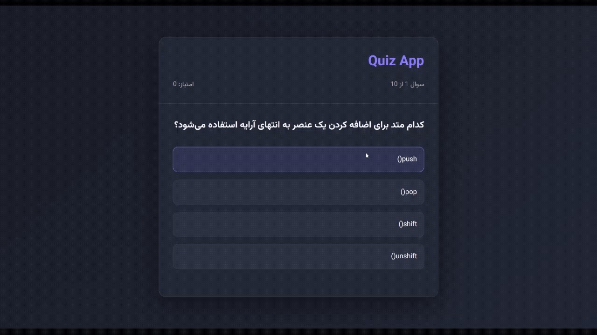

# Quiz App

اپلیکیشن کوییز چندگزینه‌ای با state machine و رندر مبتنی بر داده — تکرار الگوی Calculator با داده‌ی پویا.

## مفاهیم تمرین‌شده

- **State machine با چند حالت** — سه وضعیت اصلی (در حال پرسش، جواب داده‌شده، تمام‌شده) که `render()` بر اساسشان تصمیم می‌گیرد چه چیزی نمایش دهد
- **Immutable state updates** — تمام تغییرات state از طریق `setState({...})` عبور می‌کنند، بدون هیچ mutation مستقیم
- **رندر پویا از آرایه‌ی داده** — برخلاف Calculator (دکمه‌های ثابت در HTML)، اینجا گزینه‌های هر سوال از روی `questions[currentQuestionIndex].options` با `forEach` ساخته می‌شوند، چون تعدادشان و محتوایشان بسته به سوال متفاوت است
- **جلوگیری از تغییر جواب** — بعد از ثبت پاسخ (`isAnswered: true`)، کلیک مجدد روی گزینه‌ها نادیده گرفته می‌شود
- **مدیریت دو صفحه‌ی مجزا** — نمایش/مخفی کردن صفحه‌ی کوییز و صفحه‌ی نتیجه با ویژگی `hidden`، بدون بارگذاری مجدد صفحه

## نکته‌ی کلیدی

`render()` مسئول تصمیم‌گیری نهایی است، نه فقط نمایش:
همین الگوی «state → یک تابع تصمیم‌گیرنده → UI» که در Calculator ساخته شد، اینجا با داده‌ی پویا (لیست سوالات) تکرار شده است.

## پیش‌نمایش

## اجرا

فایل `index.html` را باز کن و به سوالات پاسخ بده.